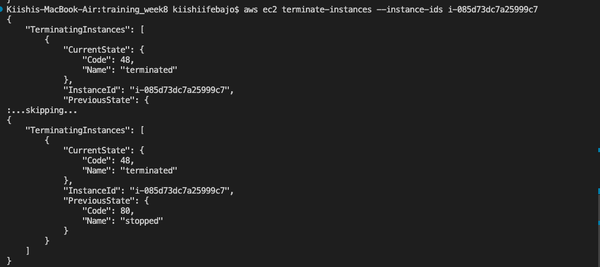

# AWS Commands
## Images for
1. [Launch an Instance](#launch)
2. [Stop an Instance](#stop)
3. [Terminate an Instance](#terminate)
4. [Create a key pair](#createkey)
5. [Delete a key pair](#delkey)

## Launch Instance

## Stop an Instance

## Terminate an Instance

## Create Key Pair

## Delete Key Pair

